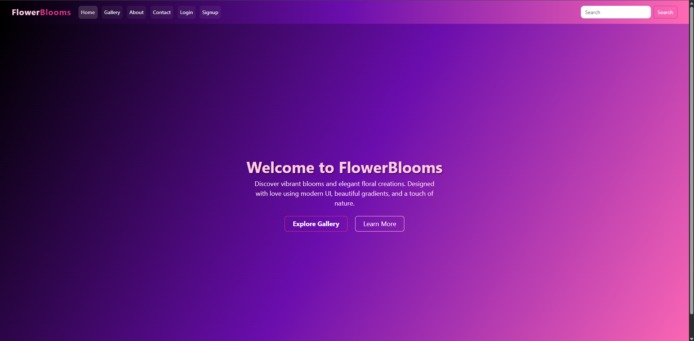
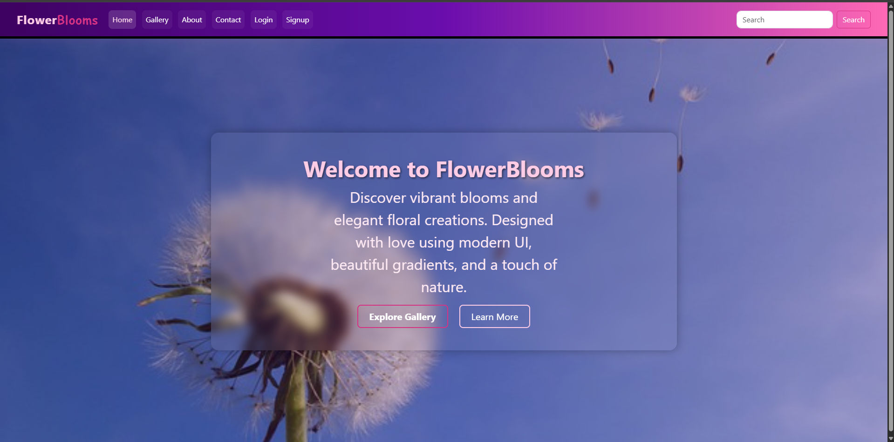
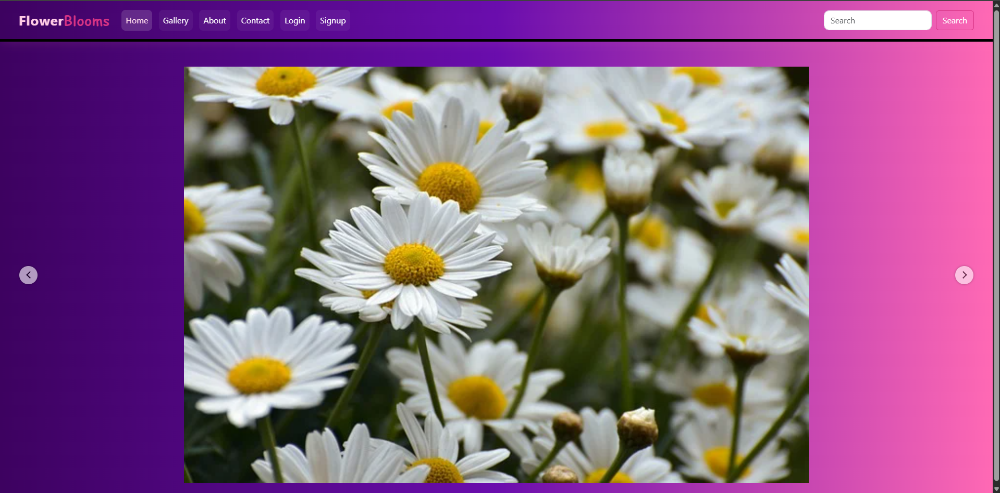
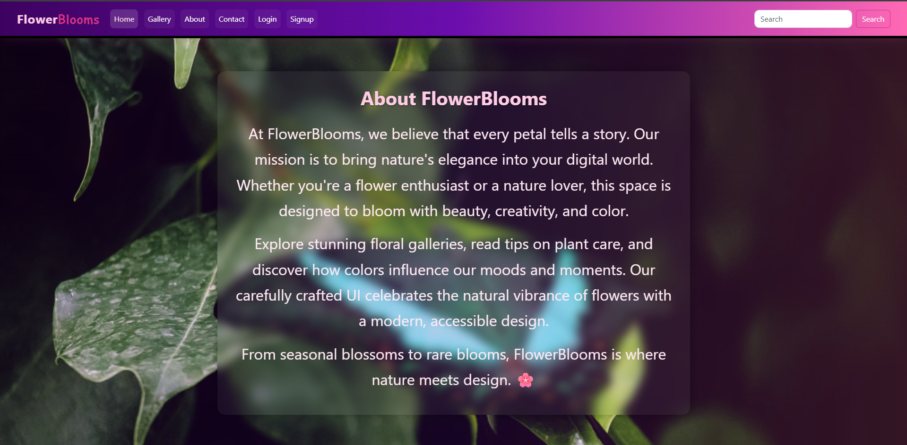
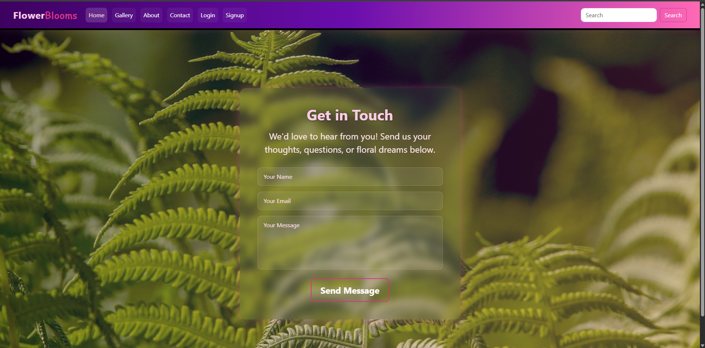
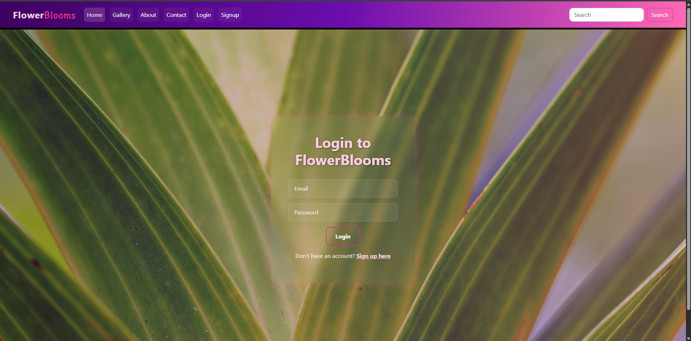
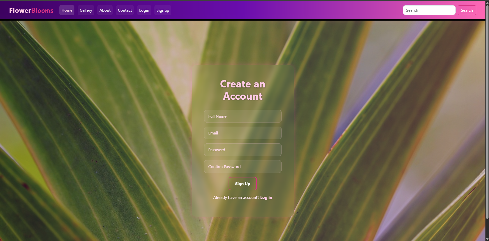

# 🌸 FlowerBlooms — A React Floral Showcase

Welcome to **FlowerBlooms**, a visually rich and beautifully themed React project built during a frontend bootcamp. It showcases a gallery of flowers with vibrant gradients, smooth navigation, and a clean UI—perfect for learning React fundamentals with a touch of real-world UI styling and basic authentication.

> 🌐 **Live Demo:** [https://flowerblooms.netlify.app](https://flowerblooms.netlify.app)

---

## 🚀 Features

- 🖁️ **React Router** for seamless page navigation
- 🎨 **Custom SCSS styling** with gradient themes
- 🖼️ **Carousel-based Gallery** (powered by `better-react-carousel`)
- 🔐 **Basic Authentication** using localStorage
- 💫 **Glassmorphism UI** for forms and navbar
- 🌿 Hero section with plant-themed background

---

## 🗂️ Pages & Components

| Route      | Component | Description                      |
| ---------- | --------- | -------------------------------- |
| `/`        | `Home`    | Landing page with hero section   |
| `/about`   | `About`   | Info about the project           |
| `/gallery` | `Gallery` | Protected carousel image gallery |
| `/contact` | `Contact` | Glass-styled contact form        |
| `/login`   | `Login`   | Simple login using localStorage  |
| `/signup`  | `Signup`  | Basic registration logic         |

---

## 🛠️ Tech Stack

- **React**
- **React Router DOM**
- **better-react-carousel**
- **SCSS / Custom CSS**
- **Bootstrap 5 (partial usage)**

---

## 🧪 Getting Started

```bash
# Clone the repo
git clone https://github.com/Code-With-Mnv/React-Bootcamp.git

# Navigate into the directory
cd React-Bootcamp

# Install dependencies
npm install

# Start the development server
npm run dev
```

---

## 🔐 Authentication

This project uses basic localStorage-based auth:

- User must **sign up first**
- On successful login, `name` is stored in `localStorage`
- `Gallery` is protected—redirects to `/login` if unauthenticated

> 🔓 _This is a demo and not secure for production usage_

---

## 📆 Deployment

The project is deployed on **Netlify**:

🌍 [https://flowerblooms.netlify.app](https://flowerblooms.netlify.app)

---

## 🙏 Acknowledgements

- [Pixabay](https://pixabay.com) for high-quality flower images
- [better-react-carousel](https://github.com/surjithctly/better-react-carousel) for carousel
- Inspiration from modern floral UI/UX design trends

---

## 📸 Screenshots









---

## 📜 License

This project is for learning purposes. You’re welcome to fork, clone, and build on top of it! Attribution appreciated 🌼
